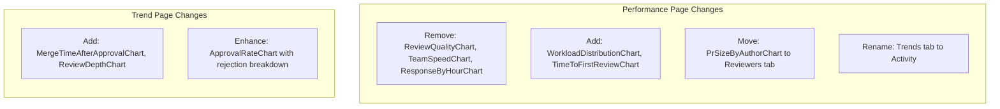

# Dashboard Charts Full Restructure

## Overview

This plan restructures both the Performance and Trend pages to eliminate redundancy, improve actionability, and add valuable new insights. The key principle: **Performance page = WHO** (individual/team performance), **Trend page = WHEN/HOW** (metrics over time).

## Changes Summary



## Phase 1: Remove Redundant Charts from Performance Page

### 1.1 Remove ReviewQualityChart

- **File**: [`src/components/performance/review-quality-chart.tsx`](src/components/performance/review-quality-chart.tsx)
- **Reason**: Radar charts are hard to read; data overlaps with ReviewerPerformanceTable
- **Action**: Remove component file and references in page.tsx and index.ts

### 1.2 Remove TeamSpeedChart  

- **File**: [`src/components/performance/team-speed-chart.tsx`](src/components/performance/team-speed-chart.tsx)
- **Reason**: Duplicates Trend page's ReviewSpeedChart
- **Action**: Remove component file and references

### 1.3 Remove ResponseByHourChart

- **File**: [`src/components/performance/response-by-hour-chart.tsx`](src/components/performance/response-by-hour-chart.tsx)
- **Reason**: Low actionability - when reviews happen is less important than who/how fast
- **Action**: Remove component file and references

### 1.4 Remove CommentsDistributionChart (Replace in Phase 2)

- **File**: [`src/components/performance/comments-distribution-chart.tsx`](src/components/performance/comments-distribution-chart.tsx)
- **Reason**: "Engagement" metric is a weak proxy; will be replaced with TimeToFirstReviewChart
- **Action**: Remove component file and references

---

## Phase 2: Add New Charts to Performance Page

### 2.1 Add WorkloadDistributionChart (Pie/Donut)

Shows how reviews are distributed across reviewers to identify imbalance.

**New file**: `src/components/performance/workload-distribution-chart.tsx`

**Data interface** (add to [`src/lib/schema/performance.ts`](src/lib/schema/performance.ts)):

```typescript
interface WorkloadDistributionData {
  reviewer: string;
  reviewCount: number;
  percentage: number;
}
```

**Service function** (add to [`src/app/api/performance/service.ts`](src/app/api/performance/service.ts)):

- Query review_assignments grouped by reviewer_id
- Calculate percentage of total reviews per reviewer

### 2.2 Add TimeToFirstReviewChart (Bar chart by reviewer)

Shows average time to first review action per reviewer - highly actionable.

**New file**: `src/components/performance/time-to-first-review-chart.tsx`

**Data interface**:

```typescript
interface TimeToFirstReviewData {
  reviewer: string;
  minutes: number;
}
```

**Service function**:

- Calculate time from PR creation to first review assignment response per reviewer

---

## Phase 3: Reorganize Performance Page Tabs

### 3.1 Move PrSizeByAuthorChart to Reviewers Tab

- Currently in Repositories tab, but it's about authors (people), not repos
- Move from Repositories tab to Reviewers tab

### 3.2 Rename "Trends" Tab to "Activity"

- Clearer distinction from the Trend page
- Only contains ReviewThroughputChart (daily/weekly patterns)

### Final Performance Page Structure:

```
Reviewers Tab:
├── ReviewerPerformanceTable
├── WorkloadDistributionChart (NEW)
├── TimeToFirstReviewChart (NEW)
├── BottleneckChart
└── PrSizeByAuthorChart (MOVED)

Repositories Tab:
├── RepoComparisonChart
└── MergeSuccessChart

Activity Tab (renamed from Trends):
└── ReviewThroughputChart
```

---

## Phase 4: Add New Charts to Trend Page

### 4.1 Add MergeTimeAfterApprovalChart

Shows time from approval to merge - measures deployment readiness.

**New file**: `src/components/trend/merge-time-chart.tsx`

**Data interface** (add to [`src/lib/schema/trend.ts`](src/lib/schema/trend.ts)):

```typescript
interface MergeTimeData {
  week: string;
  hours: number;
}
```

**Service function** (add to [`src/app/api/trend/service.ts`](src/app/api/trend/service.ts)):

- Calculate time from last approval to merged_at per PR
- Aggregate by week

### 4.2 Add ReviewDepthChart

Shows average lines reviewed per PR over time - quality indicator.

**New file**: `src/components/trend/review-depth-chart.tsx`

**Data interface**:

```typescript
interface ReviewDepthData {
  week: string;
  linesPerPr: number;
}
```

**Service function**:

- Calculate (additions + deletions) per reviewed PR
- Aggregate by week

---

## Phase 5: Update Schema and Service Files

### 5.1 Update Performance Schema

**File**: [`src/lib/schema/performance.ts`](src/lib/schema/performance.ts)

- Add new interfaces: `WorkloadDistributionData`, `TimeToFirstReviewData`
- Remove unused interfaces: `ReviewQualityDataset`, `CommentsDistributionData`, `TeamSpeedData`, `ResponseByHourData`
- Update `PerformanceData` interface

### 5.2 Update Performance Service

**File**: [`src/app/api/performance/service.ts`](src/app/api/performance/service.ts)

- Add: `fetchWorkloadDistributionData()`, `fetchTimeToFirstReviewData()`
- Remove: `fetchReviewQualityData()`, `fetchCommentsDistributionData()`, `fetchTeamSpeedData()`, `fetchResponseByHourData()`
- Update `fetchPerformanceData()` main function

### 5.3 Update Trend Schema

**File**: [`src/lib/schema/trend.ts`](src/lib/schema/trend.ts)

- Add new interfaces: `MergeTimeData`, `ReviewDepthData`
- Update `TrendData` interface

### 5.4 Update Trend Service

**File**: [`src/app/api/trend/service.ts`](src/app/api/trend/service.ts)

- Add: `fetchMergeTimeData()`, `fetchReviewDepthData()`
- Update `fetchTrendData()` main function

---

## Phase 6: Update Page Components

### 6.1 Update Performance Page

**File**: [`src/app/(main)/performance/page.tsx`](src/app/\(main)/performance/page.tsx)

- Update imports (remove old, add new)
- Reorganize Reviewers tab with new charts
- Move PrSizeByAuthorChart to Reviewers tab
- Rename Trends tab to Activity
- Remove TeamSpeedChart and ResponseByHourChart from Activity tab

### 6.2 Update Trend Page

**File**: [`src/app/(main)/trend/page.tsx`](src/app/\(main)/trend/page.tsx)

- Add MergeTimeAfterApprovalChart to Speed tab
- Add ReviewDepthChart to Quality tab

### 6.3 Update Component Exports

**File**: [`src/components/performance/index.ts`](src/components/performance/index.ts)

- Remove exports for deleted components
- Add exports for new components

**File**: [`src/components/trend/index.ts`](src/components/trend/index.ts)

- Add exports for new components

---

## Files to Create

1. `src/components/performance/workload-distribution-chart.tsx`
2. `src/components/performance/time-to-first-review-chart.tsx`
3. `src/components/trend/merge-time-chart.tsx`
4. `src/components/trend/review-depth-chart.tsx`

## Files to Delete

1. `src/components/performance/review-quality-chart.tsx`
2. `src/components/performance/team-speed-chart.tsx`
3. `src/components/performance/response-by-hour-chart.tsx`
4. `src/components/performance/comments-distribution-chart.tsx`

## Files to Modify

1. `src/lib/schema/performance.ts`
2. `src/lib/schema/trend.ts`
3. `src/app/api/performance/service.ts`
4. `src/app/api/trend/service.ts`
5. `src/app/(main)/performance/page.tsx`
6. `src/app/(main)/trend/page.tsx`
7. `src/components/performance/index.ts`
8. `src/components/trend/index.ts`